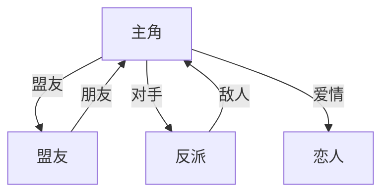

# Script Up · 剧本分析工具 (Script Analysis Tool)

## 概述 (Overview)

这是一个**专业级剧本分析工具**，整合了9大经典编剧理论体系，能够对剧本文件（PDF/Fountain/TXT）或电影情节进行**深度文本分析**，并生成**精细化的学习报告**，帮助编剧学习者和教育工作者理解剧本创作的精髓。

### 核心价值
- 🎯 **多维度分析** - 同时应用9个理论框架，全面分析剧本
- 📊 **精细化表格** - 逐场景分析，16维度评估表格
- 🎨 **可视化输出** - 人物关系图、情感曲线、结构图表
- 📚 **学习导向** - 不仅分析，更提供可操作的学习要点
- 🎓 **经典致敬** - 分析经典作品以学习，而非评判

## 适用场景 (When to Use This Skill)

触发此技能当用户请求：

### 📖 剧本分析
- "分析《教父》的剧本结构"
- "我有一个剧本文件，请帮我分析"
- "分析剧本的写作技巧"

### 🎓 编剧学习
- "解释《救猫咪》的15个节拍点"
- "如何理解人物弧光？"
- "序列法是如何工作的？"

### 📊 生成学习材料
- "生成一份关于《星球大战》的剧本分析报告"
- "创建人物关系和学习要点的文件"
- "帮我制作一个编剧学习指南"

### 🔍 深度文本分析
- "逐场景分析这个剧本"
- "分析关键场景的潜文本"
- "追踪人物关系变化"

## 整合的9大理论框架 (Core Analysis Frameworks)

加载并在分析中引用这些文档：

### 1. Robert McKee《故事》理论
**参考文档：** `references/story_theory.md`

**核心概念**：
- 故事结构层次（事件 → 场景 → 序列 → 幕 → 故事）
- 故事价值与价值转换
- 人物维度（人物塑造 vs. 人物真相 vs. 人物弧光）
- 场景分析（冲突、转折、价值转换）
- 对白与潜文本

### 2. Blake Snyder《救猫咪》
**参考文档：** `references/save_the_cat.md`

**核心概念**：
- 10种故事类型
- 15个节拍点（开场画面、主题呈现、催化剂等）
- 三幕结构精确页码
- "救猫咪"时刻（英雄亲和力）
- A故事与B故事整合

### 3. 三幕剧结构
**参考文档：** `references/three_act_structure.md`

**核心概念**：
- 第一幕：设置（25-30%）
- 第二幕：对抗（50-60%）
- 第三幕：结局（20-25%）
- 转折点与情节要点
- 中点功能

### 4. Joseph Campbell英雄之旅
**参考文档：** `references/hero_journey.md`

**核心概念**：
- 12个阶段（平凡世界 → 冒险召唤 → ... → 携带万能药返回）
- 人物原型（英雄、导师、影子、愚者等）
- 平凡世界 vs. 特殊世界
- 磨难与复活

### 5. 序列法 (Sequence Method) ⭐ **新增**
**参考文档：** `references/sequence_method.md`

**核心概念**：
- 8序列模型（或12序列模型）
- 每个序列 = 8-15页/分钟
- 序列功能、目标、冲突、转折
- 节奏与 pacing 分析
- 专业剧本医生技术

### 6. 场景构建 (Scene Construction) ⭐ **新增**
**参考文档：** `references/scene_construction.md`

**核心概念**：
- 场景结构（开头、中段、结尾）
- 晚进早出原则（Enter Late, Leave Early）
- 冲突类型（内在、人际、社会、自然等）
- 价值转换分析
- 对白潜文本
- 场景节奏与韵律

### 7. 人物分析
**参考文档：** `references/character_analysis.md`

**核心概念**：
- 人物弧光（正向、负向、平弧）
- 人物维度（McKee的三维度）
- 人物关系（盟友、对手、爱情、导师、家庭）
- 人物动线（物理、心理、情感、关系）

### 8. 类型片惯例 (Genre Conventions) ⭐ **新增**
**参考文档：** `references/genre_conventions.md`

**核心概念**：
- 类型识别与分析
- 类型惯例（观众期望）
- 遵循 vs. 颠覆惯例
- 混合类型分析
- 类型特定的结构与节奏

**覆盖类型：**
- 动作片、爱情片、惊悚/恐怖片
- 喜剧片、剧情片、科幻片
- 犯罪片、西部片

### 9. 主题与潜文本分析 (Theme and Subtext) ⭐ **新增**
**参考文档：** `references/theme_analysis.md`

**核心概念**：
- 主题识别与分析
- "展示，不要告诉"原则
- 潜文本层次（字面、情境、情感、主题）
- 象征与隐喻追踪
- 主题通过人物弧光体现

### 10. 细致场景分析 (Detailed Scene Analysis) ⭐ **新增**
**参考文档：** `references/detailed_scene_analysis.md`

**核心概念**：
- **完整场景分析表**（16个字段，精细分析）
- **对白分析表**（潜文本逐句分析）
- **人物动线追踪表**（关系变化追踪）
- **主题发展追踪表**（主题随时间发展）
- **基于文本的深度分析**

## 分析工作流程 (Analysis Workflow)

### 步骤1：理解输入 (Step 1: Understand the Input)
- 如果用户提供了剧本文件，**读取并分析**
- 如果用户描述了情节，**必要时请求澄清**
- 识别媒介：完整剧本 vs. 情节概要
- 识别类型和目标观众

### 步骤2：应用多理论框架 (Step 2: Apply Multiple Frameworks)
使用**所有相关框架**分析剧本/情节：

1. **结构分析** - 识别幕转折点、高潮
2. **节拍表分析**（如果使用《救猫咪》）- 映射15个节拍
3. **序列分析** - 分解为8-12个序列
4. **英雄之旅分析** - 映射12个阶段（如适用）
5. **场景分析** - **逐场景深度分析**冲突和价值转换
6. **人物分析** - 分析人物弧光和关系
7. **主题分析** - 识别和主题与潜文本
8. **类型分析** - 评估类型惯例和创新
9. **细致场景分析** - **生成精细化表格**（16字段）

### 步骤3：生成可视化输出 (Step 3: Generate Visual Outputs)
使用Mermaid语法或表格创建以下可视化：

1. **三幕结构图表** - 故事时间线可视化
2. **序列图表** - 8-12序列分解
3. **人物关系图** - 人物关系网络图
4. **人物弧光图** - 展示每个主要人物如何变化
5. **情感曲线图** - 随时间变化的情感强度图
6. **节拍表** - 带页码/时间戳的救猫咪节拍
7. **英雄之旅地图** - 12阶段可视化地图
8. **主题追踪图表** - 主题如何发展

### 步骤4：创建学习报告 (Step 4: Create Learning Report)
生成**全面的Markdown报告**，包含：

1. **执行摘要** - 发现要点概述
2. **结构分析** - 使用每个框架的详细分解
3. **人物分析** - 人物档案、关系、弧光
4. **场景分析** - **逐场景精细化分析表格**
5. **主题分析** - 主题识别和分析
6. **类型分析** - 类型惯例和创新
7. **关键场景分析** - 3-5个关键场景的深度分析
8. **学习要点** - 编剧可以从这次分析中学到什么
9. **可视化** - 所有图表和图形

## 输出格式详解 (Output Format Details)

### 📊 精细化表格示例

#### 完整场景分析表（16字段）
| 场景# | 页码 | 场景名 | 地点 | 时间 | 人物 | 场景类型 | 功能 | 主角目标 | 冲突类型 | 对手 | 价值开始 | 价值结束 | 价值转换 | 转折点 | 潜文本评分 | 节奏评分 | 晚进早出 |
|--------|------|--------|------|------|------|----------|------|----------|----------|------|----------|----------|----------|--------|----------|----------|----------|
| 1 | 1-3 | 开场 | 餐厅 | 早上 | A,B | 主动 | 建立关系 | 表白 | 人际 | B | 正面 | 负面 | +/- | 被拒绝 | 8/10 | 7/10 | ✅ |

#### 对白分析表（潜文本分析）
| 场景# | 人物 | 对白 | 字面意思 | 潜文本 | 情感 | 主题 | 效果 | 评分 |
|--------|------|------|----------|--------|------|------|------|------|
| 5 | A | "我很好" | 我状态好 | 我在撒谎，其实很痛苦 | 伪装 | 伪装vs真相 | 有效 | 9/10 |

#### 人物动线追踪表
| 场景# | 页码 | 人物A | 人物B | 关系类型 | 关系状态 | 变化 | 情感A | 情感B | 转折点 |
|--------|------|--------|--------|----------|----------|------|--------|--------|----------|
| 1 | 1-3 | 小明 | 小红 | 暗恋 | 紧张 | 表白失败 | 焦虑 | 困惑 | 被拒绝 |

### 📈 可视化图表示例

#### 人物关系图 (Mermaid)


#### 序列分析图 (Mermaid Gantt)

```mermaid
gantt
    title 序列分解
    dateFormat X
    axisFormat %L
    section 序列
    序列1: 设置 :s1, 0, 12
    序列2: 反应 :s2, 12, 25
    序列3: 新世界 :s3, 25, 35
    序列4: 游戏 :s4, 35, 45
    序列5: 中点 :s5, 45, 55
    序列6: 坏蛋逼近 :s6, 55, 65
    序列7: 一无所有 :s7, 65, 75
    序列8: 结局 :s8, 75, 90
```


#### 情感曲线图 (Mermaid XYChart)
```mermaid
xychart-beta
    title "情感曲线"
    x-axis [开场, 激励事件, 中点, 一无所有, 高潮, 结局]
    y-axis "情感强度" 0 --> 10
    line [3, 5, 7, 2, 9, 8]
```

## 重要说明 (Important Notes)

### 当分析剧本时
- **尊重版权** - 不要复制剧本的大段内容
- **聚焦结构分析** - 而不是复制内容
- **如果未提供剧本** - 使用用户的情节描述工作
- **始终提供教育价值** - 分析经典，学习精髓

### 当分析情节时（无剧本）
- **如果情节概要模糊，请求澄清问题**
- **聚焦可识别的结构元素**
- **基于该类型的典型结构生成"示例分析"**
- **使用知名电影作为参考点**

### 平衡多理论
- **并非所有理论都同等适用于所有故事**
- **突出最能解释故事的理论**
- **注意故事偏离标准模型的地方**
- **使用多理论提供全面分析**

### 学习导向
- **始终包含"学习要点"部分**
- **解释为什么某些结构选择有效**
- **在有帮助时与知名电影比较**
- **为编剧提供可操作的学习要点**
- **正确使用专业术语**

### 基于文本的深度分析
- **当提供剧本文件时，进行逐场景分析**
- **生成精细化表格（16个字段）**
- **追踪人物动线、情感曲线、主题发展**
- **所有分析都要引用剧本原文**
- **不只给表格，还要分析"为什么"**

### 经典作品分析原则
- **分析是为了学习，而非评判**
- **专注于理解大师的技巧**
- **提取可学习的要点**
- **避免班门弄斧式的评价**

## 资源 (Resources)

### 参考文档（按需加载）
- `references/story_theory.md` - McKee《故事》理论
- `references/save_the_cat.md` - Snyder《救猫咪》
- `references/three_act_structure.md` - 经典三幕结构
- `references/hero_journey.md` - Campbell英雄之旅
- `references/sequence_method.md` - 序列法 ⭐新增
- `references/scene_construction.md` - 场景构建 ⭐新增
- `references/character_analysis.md` - 人物分析方法
- `references/genre_conventions.md` - 类型片惯例 ⭐新增
- `references/theme_analysis.md` - 主题与潜文本分析 ⭐新增
- `references/detailed_scene_analysis.md` - 细致场景分析 ⭐新增

### 脚本（如需自动化）
- `scripts/parse_script.py` - （可选）剧本解析工具

### 资产（输出模板）
- `assets/report_template.md` - 报告模板

## 示例交互 (Example Interactions)

**用户：** "你能分析《教父》的结构吗？"
**响应：** 加载英雄之旅、人物分析、主题分析、类型片惯例参考文档，提供所有框架的全面分析，生成人物关系图和弧光图。

**用户：** "我有一个剧本文件，能帮我分析吗？"
**响应：** 读取剧本文件，应用所有框架，生成带可视化的全面报告，**逐场景精细化分析**。

**用户：** "为初学者解释《救猫咪》节拍表"
**响应：** 加载《救猫咪》参考文档，提供带有知名电影示例的教育解释。

**用户：** "帮我更好地理解人物弧光"
**响应：** 加载人物分析参考文档，解释正向/负向/平弧，附带示例，生成人物弧光图。

**用户：** "动作片的类型惯例是什么？"
**响应：** 加载类型片惯例参考文档，解释动作片惯例，提供示例。

**用户：** "如何分析电影的主题？"
**响应：** 加载主题分析参考文档，解释主题识别和分析技巧，提供示例。

**用户：** "逐场景分析我的剧本"
**响应：** 加载细致场景分析参考文档，生成16字段精细化表格，追踪人物动线、情感曲线、主题发展。

## 安装说明 (Installation)

1. 下载 `script-writing-analysis.zip` 文件
2. 在WorkBuddy中进入Skill管理页面
3. 点击"安装Skill"，上传此zip文件
4. 安装完成后，Skill将自动可用

## 技术支持 (Technical Support)

如有问题或建议，请参考：
- Skill Creator文档
- WorkBuddy官方文档
- 或直接在对话中咨询

---

**版本：** 2.1  
**最后更新：** 2026-05-13  
**作者：** WorkBuddy AI  
**许可：** MIT License
