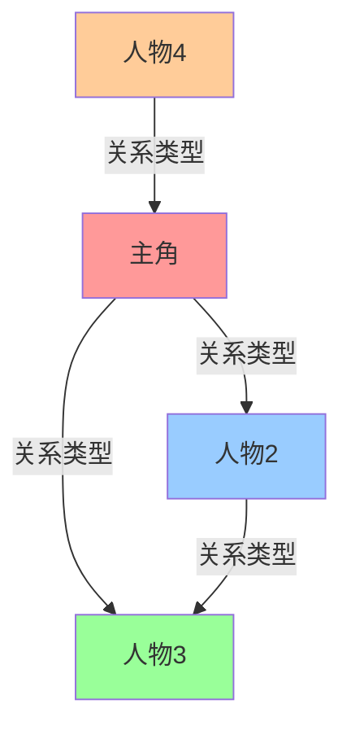

# 剧本分析报告模板

## 元信息
- **影片/剧本名称**: [Title]
- **分析日期**: [Date]
- **分析者**: [Analyst]
- **使用的理论框架**: [Frameworks Used]

---

## 1. 执行摘要 (Executive Summary)

[用1-2段话概括整体分析结果]

**核心发现**:
- 结构类型：[三幕剧/英雄之旅/其他]
- 主要特点：[列出2-3个显著特点]
- 关键技巧：[列出2-3个值得学习的技巧]

---

## 2. 结构分析 (Structure Analysis)

### 2.1 三幕剧结构分析

**第一幕：设置 (Setup)**
- 篇幅：[X 页/分钟, 占总数 X%]
- 激励事件：[描述，发生在哪里？]
- 第一幕转折点：[描述]
- 分析：[是否有效？为什么？]

**第二幕：对抗 (Confrontation)**
- 篇幅：[X 页/分钟, 占总数 X%]
- 中点：[描述，虚假胜利还是失败？]
- 一无所有时刻：[描述]
- 分析：[冲突是否升级？如何处理的？]

**第三幕：结局 (Resolution)**
- 篇幅：[X 页/分钟, 占总数 X%]
- 高潮：[描述]
- 结局：[描述]
- 分析：[是否解决了所有线索？如何处理？]

**三幕结构图表**:

```mermaid
gantt
    title 三幕剧结构时间线
    dateFormat X
    axisFormat %L
    section 第一幕
    设置 :a1, 0, 25
    section 第二幕
    对抗 :a2, 25, 75
    section 第三幕
    结局 :a3, 75, 100
```


### 2.2 《救猫咪》节拍表分析

| 节拍点 | 页码/时间 | 描述 | 是否有效 | 备注 |
|--------|-----------|------|----------|------|
| 1. 开场画面 | p.1 | [描述] | ✅/❌ | [备注] |
| 2. 主题呈现 | p.5 | [描述] | ✅/❌ | [备注] |
| 3. 设置 | p.1-10 | [描述] | ✅/❌ | [备注] |
| 4. 催化剂 | p.12 | [描述] | ✅/❌ | [备注] |
| 5. 争论 | p.12-25 | [描述] | ✅/❌ | [备注] |
| 6. 第二幕衔接点 | p.25 | [描述] | ✅/❌ | [备注] |
| 7. 游戏 | p.25-55 | [描述] | ✅/❌ | [备注] |
| 8. 中点 | p.55 | [描述] | ✅/❌ | [备注] |
| 9. 坏蛋逼近 | p.55-75 | [描述] | ✅/❌ | [备注] |
| 10. 一无所有 | p.75 | [描述] | ✅/❌ | [备注] |
| 11. 黎明前的黑暗 | p.75-85 | [描述] | ✅/❌ | [备注] |
| 12. 第三幕衔接点 | p.85 | [描述] | ✅/❌ | [备注] |
| 13. 结局高潮 | p.85-110 | [描述] | ✅/❌ | [备注] |
| 14. 最终画面 | p.110 | [描述] | ✅/❌ | [备注] |

**分析**:
- [哪些节拍点有效？为什么？]
- [哪些节拍点有创意变化？]

### 2.3 英雄之旅分析

| 阶段 | 对应位置 | 描述 | 是否有效 |
|------|----------|------|----------|
| 1. 平凡世界 | [位置] | [描述] | ✅/❌ |
| 2. 冒险召唤 | [位置] | [描述] | ✅/❌ |
| 3. 拒绝召唤 | [位置] | [描述] | ✅/❌ |
| 4. 遇见导师 | [位置] | [描述] | ✅/❌ |
| 5. 跨越第一道门槛 | [位置] | [描述] | ✅/❌ |
| 6. 考验、伙伴、敌人 | [位置] | [描述] | ✅/❌ |
| 7. 接近最深的洞穴 | [位置] | [描述] | ✅/❌ |
| 8. 磨难 | [位置] | [描述] | ✅/❌ |
| 9. 奖赏 | [位置] | [描述] | ✅/❌ |
| 10. 返回的路 | [位置] | [描述] | ✅/❌ |
| 11. 复活 | [位置] | [描述] | ✅/❌ |
| 12. 携带万能药返回 | [位置] | [描述] | ✅/❌ |

**分析**:
- [英雄之旅是否完整？]
- [哪些阶段有创意变化？]

### 2.4 Robert McKee《故事》理论分析

**故事价值**:
- 核心故事价值：[如：正义/非正义]
- 价值转换是否有效：✅/❌
- 分析：[如何处理的？]

**幕的结构**:
- 第一幕转折点：[描述]
- 第二幕转折点：[描述]
- 高潮：[描述]

**场景分析** (关键场景):
1. **场景1**: [描述] - 是否有冲突？是否有转折？价值是否转换？
2. **场景2**: [描述] - 是否有冲突？是否有转折？价值是否转换？
3. **场景3**: [描述] - 是否有冲突？是否有转折？价值是否转换？

**对白分析**:
- 潜文本质量：✅/❌
- 分析：[如何体现潜文本的？]
- 是否避免信息堆砌：✅/❌

---

## 3. 人物分析 (Character Analysis)

### 3.1 主要人物档案

#### 人物1: [姓名]
- **角色功能**: [主角/对手/盟友/导师/等]
- **外在特征**: [年龄、职业、外貌等]
- **内在真相**: [在压力下会做什么选择？]
- **核心缺陷 (Lie)**: [误解或缺陷]
- **真相 (Truth)**: [需要学到的真理]
- **人物弧光**: [正向/负向/平弧]
- **分析**: [人物是否立体？如何塑造的？]

#### 人物2: [姓名]
[同上格式]

#### 人物3: [姓名]
[同上格式]

### 3.2 人物关系图



**关系说明**:
- [主角] 与 [人物2]: [关系类型，如何变化]
- [主角] 与 [人物3]: [关系类型，如何变化]
- [人物2] 与 [人物3]: [关系类型，如何变化]

### 3.3 人物弧光分析

#### [人物姓名] 的弧光
**开始状态**: [描述初始状态]
**转折点1**: [描述]
**转折点2**: [描述]
**结局状态**: [描述最终状态]

**弧光图表**:


[对其他主要人物重复以上分析]

### 3.4 人物动线分析

#### 物理动线
- [描述人物在物理空间中的移动]
- [这与心理旅程的关系]

#### 心理动线
- [描述人物内在的变化过程]
- [关键转折点]

#### 情感动线
```mermaid
xychart-beta
    title "情感曲线"
    x-axis [开场, 激励事件, 中点, 一无所有, 高潮, 结局]
    y-axis "情感强度" 0 --> 10
    line [3, 5, 7, 2, 9, 8]
```

#### 关系动线
- [描述人物关系如何随时间变化]

---

## 4. 关键场景分析 (Key Scenes Analysis)

### 场景1: [场景名称]
- **位置**: [页码/时间]
- **参与人物**: [人物列表]
- **冲突**: [描述冲突]
- **转折**: [描述转折]
- **价值转换**: [正面→负面 或 负面→正面]
- **分析**: [为什么这个场景有效？用了什么技巧？]

### 场景2: [场景名称]
[同上格式]

### 场景3: [场景名称]
[同上格式]

---

## 5. 主题与潜文本分析 (Theme and Subtext Analysis)

### 5.1 主题识别

**核心主题**:
1. [主题1] - [如何体现？]
2. [主题2] - [如何体现？]
3. [主题3] - [如何体现？]

### 5.2 潜文本层次分析

| 层次 | 字面意思 | 情境潜文本 | 情感潜文本 | 主题潜文本 |
|------|----------|------------|------------|------------|
| **场景X** | [字面] | [情境] | [情感] | [主题] |
| **场景Y** | [字面] | [情境] | [情感] | [主题] |

### 5.3 象征与隐喻追踪

| 象征物 | 出现场景 | 象征意义 | 主题关联 |
|--------|----------|----------|----------|
| [象征1] | [场景] | [意义] | [主题] |
| [象征2] | [场景] | [意义] | [主题] |

---

## 6. 类型片分析 (Genre Analysis)

### 6.1 类型识别

**主要类型**: **[类型名称]**  
**次要类型**: **[类型名称]**

### 6.2 类型惯例分析

#### [类型名称] 惯例
- ✅ [惯例1]：[如何体现？]
- ✅ [惯例2]：[如何体现？]
- ⚠️ [创新点]：[如何颠覆或创新？]

### 6.3 类型比较

[与同类型其他作品比较，分析其独特之处]

---

## 7. 学习要点 (Learning Points)

### 结构设计要点
1. [要点1]: [解释，如何从本剧中学到？]
2. [要点2]: [解释，如何从本剧中学到？]
3. [要点3]: [解释，如何从本剧中学到？]

### 人物塑造要点
1. [要点1]: [解释，如何从本剧中学到？]
2. [要点2]: [解释，如何从本剧中学到？]

### 对白写作要点
1. [要点1]: [解释，如何从本剧中学到？]
2. [要点2]: [解释，如何从本剧中学到？]

### 可以应用到自己写作的技巧
1. [技巧1]: [如何应用？]
2. [技巧2]: [如何应用？]

---

## 8. 可视化图表 (Visualizations)

### 故事结构综合图
[包含所有分析框架的综合图表]

### 人物关系网络图
[更详细的人物关系图]

### 情感曲线图
[所有主要人物的情感曲线对比]

### 主题发展图
[主题如何随时间发展]

---

## 9. 总结 (Conclusion)

[1-2段话总结整个分析]

**最值得学习的3点**:
1. [点1] - [为什么？]
2. [点2] - [为什么？]
3. [点3] - [为什么？]

**值得注意的3点**:
1. [点1] - [为什么？]
2. [点2] - [为什么？]
3. [点3] - [为什么？]

---

## 附录 (Appendix)

### A. 参考资料
- Robert McKee, "Story"
- Blake Snyder, "Save the Cat"
- Joseph Campbell, "The Hero with a Thousand Faces"
- [其他参考资料]

### B. 分析方法说明
[简要说明使用了哪些理论框架，为什么选择这些框架]

### C. 版权声明
[如果分析了完整剧本，在此声明版权尊重]

### D. 分析原则
- 本分析旨在学习经典作品之精髓
- 专注于理解大师技巧，而非评判作品
- 提取可学习要点，应用于实践
